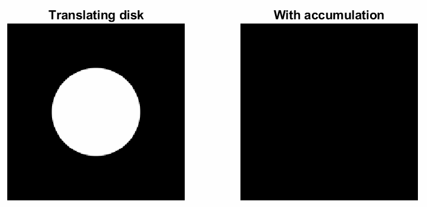

# Official respository for "[Modeling Defocus-Disparity in Dual-Pixel Sensors](https://abhijithpunnappurath.github.io/ICCP2020.pdf)", ICCP 2020

### BibTeX
```BibTeX
@INPROCEEDINGS{punnappurath2020modeling,
   author={Abhijith Punnappurath and Abdullah Abuolaim and Mahmoud Afifi and Michael S. Brown},
   booktitle={IEEE International Conference on Computational Photography (ICCP)}, 
   title={Modeling Defocus-Disparity in Dual-Pixel Sensors}, 
   year={2020}
}
```
### How to run
 - This is the code for the optimization-based approach described in Section 4.1 of our [paper.](https://abhijithpunnappurath.github.io/ICCP2020.pdf) The implementation is in Matlab.   
 - The post-process edge-aware filtering described in Section 4.3 consists of a [bilateral solver](https://arxiv.org/abs/1511.03296) and a [guided filter](http://kaiminghe.com/publications/eccv10guidedfilter.pdf). Official implementations released by the authors have been used - the [bilateral solver](https://github.com/poolio/bilateral_solver) is in Python and the [guided filter](http://kaiminghe.com/eccv10/) in Matlab.
 - To obtain our final result, run Steps [1](./Step1_optimization.m), [2](./Step2_bilateral_solver.py), and [3](./Step3_guided_filter.m) sequentially, where Step 1 is the main optimization, and Steps 2 and 3 are the post-process bilateral solver and guided filter, respectively.
 - The data corresponding to Fig. 7 of our paper can be found [here](./Quantitative), and Figs. 1 and 8 can be found [here](./Qualitative).
 - Running the code **_as is_** produces our result in Fig. 8(f) third column.
 - Other outputs can be generated by appropriately setting the input image path [here](./Step1_optimization.m#L25-L28) in Step 1, and [here](./Step2_bilateral_solver.py#L165-L166) and [here](./Step3_guided_filter.m#L15-L16) in Steps 2 and 3, respectively.
    - The ```img_name``` variable to use for Steps 2 and 3 will be displayed when Step 1 finishes execution.
 - Note that the optimization-based approach is very slow since it requires minimizing our cost function of equation (7) at each window.
 
 ### Video spotlight
  - Watch the YouTube video [here](https://www.youtube.com/watch?v=Ow2ffrqjPiI&feature=youtu.be&t=117)
 
 ### Visualization of our parameterized dual-pixel kernel of equation 6
 
 
 ### Also check out
  - If you are here out of interest in dual-pixel depth estimation in general, also check out [my implementation](https://github.com/abhijithpunnappurath/dual-pixel-stereo-disparity) of the [stereo-based algorithm](https://arxiv.org/abs/1806.04171) used on the Google Pixel 2.
